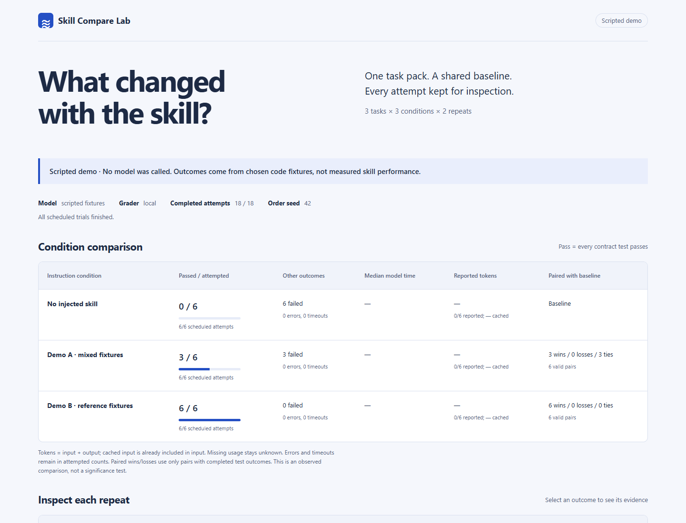

# Skill Compare Lab

**Does a coding skill change the result? Run the same task with and without it, then inspect the evidence.**

[中文说明](docs/README.zh-CN.md)



Skill Compare Lab is a small, local workbench for comparing **instruction-only SKILL.md files** on Python repair tasks. It includes a baseline, repeated trials, executable contract tests, token accounting, and a shareable offline HTML report. The Python package has no runtime dependencies.

## Try it without a model

Python 3.11 or newer:

```sh
git clone https://github.com/wcsnbilil/skill-compare-lab.git
cd skill-compare-lab
python -m skill_compare_lab demo --output runs/demo
```

Open `runs/demo/report.html` in your browser. Select a result to inspect the code diff, test output and prompt. The HTML file works offline and can be copied on its own.

**Demo results are scripted fixtures, not evidence that a skill improves a model.** The demo really executes the bundled tests against selected buggy/fixed code, makes no model calls, and leaves token usage unknown. Its three conditions are deliberately different to show the report's behavior.

## Run your skills

Install the CLI with `python -m pip install .`. Install and authenticate [Codex CLI](https://learn.chatgpt.com/docs/non-interactive-mode), and prepare Docker for grading:

```sh
docker pull python:3.12-slim
skill-compare run --skill examples/skills/contract-first --skill examples/skills/minimal-change --model YOUR_MODEL_ID --repeats 3 --output runs/comparison
```

Replace `YOUR_MODEL_ID` with a model available to your account. This example schedules **27 model calls**: 3 tasks × 3 conditions × 3 repeats. For an integration smoke test, add `--task chunks --repeats 1` (3 calls). Calls consume your configured model's usage; skill text is sent to that model.

Each `--skill` accepts a SKILL.md file or its containing folder. Use unique folder names. The baseline is included automatically. `--timeout` limits each model call; `--seed` controls trial order, not model determinism. Results are never overwritten: choose a new output folder for every experiment.

## Bring your own tasks

Use your actual repair contracts instead of only the three bundled exercises. A JSON task pack points to initial code, unittest tests, and an optional reference implementation. Paths are resolved relative to the pack file; you do not need to edit the tool's source.

```sh
skill-compare tasks --pack examples/task-packs/text-cleanup/pack.json
skill-compare validate-pack examples/task-packs/text-cleanup/pack.json --output runs/pack-check
skill-compare run --pack examples/task-packs/text-cleanup/pack.json --skill examples/skills/contract-first --model YOUR_MODEL_ID --repeats 3 --output runs/my-tasks
```

Listing reads and checks the pack without executing its Python. `validate-pack` makes no model calls: it runs the reference and starter through the grader and succeeds only when the reference passes all tests and the starter fails without timing out. It requires reference files; live comparisons can omit them. Both commands that execute code default to Docker. The one-task example above schedules six model calls, including the baseline.

See [the task-pack guide](docs/task-packs.md) for the format, a copyable example and supported test behavior. The report records the pack name and content hash; `task-snapshot.json` preserves the loaded definitions even if the original files later change. Tests and reference solutions are never included in the model prompt.

Live grading defaults to a Docker container with no network, a read-only filesystem, a read-only trial mount, resource limits and a non-root user. The image ID is recorded. **The Codex process runs separately with its read-only sandbox and your existing configuration.** Docker grading does not sandbox the Codex process itself.

For a disposable development environment and trusted inputs, `--executor local` runs generated Python directly on the host. A subprocess timeout and a reduced environment are not a security boundary. Never use local grading for untrusted submissions.

## What the report measures

| Measure | Meaning |
|---|---|
| Passed / attempted | A pass requires every contract test to pass; errors and timeouts remain visible in attempted counts |
| Paired wins / losses / ties | Candidate versus baseline for the same task and repeat, restricted to pairs with completed test outcomes |
| Model time | Wall-clock time of the runner, including CLI startup and any tool work; grading is separate |
| Reported tokens | CLI-reported input + output; cached input is shown separately and is already included in input |
| Usage coverage | How many trials reported valid usage; missing usage is never replaced by zero |
| Trial evidence | Prompt, generated module, diff, test logs, runner events, hashes and configuration |

Runner errors stop the experiment with a partial report instead of repeatedly spending usage on a broken setup. Failed solutions and timeouts remain recorded. An interrupted run preserves previously completed trials. A timeout may still consume usage that the CLI did not report, so reported token totals are not a billing statement.

```sh
skill-compare tasks
skill-compare report runs/comparison
python -m unittest discover -s tests -v
```

## Current scope

- Three bundled repair contracts plus custom JSON task packs, using one Python module per task and standard-library unittest grading. Multi-file repositories, pytest and extra dependencies are not yet supported.
- Skill **text is injected into a task prompt**. This measures explicit instruction effects, not whether an agent discovers or activates a native skill. Supporting scripts, assets, references and tool-dependent workflows are outside this version's scope.
- The model returns one complete Python module; grading runs separately with fresh tests that are not included in the prompt. These public tasks are not a secret benchmark or an adversarially hardened judge.
- The Codex runner inherits user configuration and potentially global instructions. Keep those fixed, record relevant settings alongside the run, and use a dedicated environment for stronger experimental control. It does not silently disable your configuration or approval rules.
- Three tasks and a few repeats are exploratory. A higher observed pass count does not establish statistical significance, general skill quality or a universal ranking. Public task familiarity and independent model randomness can affect results.
- Demo fixtures are fully offline. Live Codex and Docker availability depend on your environment. CI exercises offline grading and the CLI protocol; it does not use account credentials or spend model tokens.

The output folder contains `manifest.json`, `results.json`, `task-snapshot.json`, skill snapshots and per-trial evidence. It is ignored by Git. Reports embed prompts and code; the snapshot contains all loaded task definitions, including tests and references. Raw logs may contain additional private context. Review artifacts before sharing them.

## Companion skill

[`skills/compare-skills/SKILL.md`](skills/compare-skills/SKILL.md) guides an agent through running and interpreting comparisons. The two instruction-only sample skills in `examples/skills/` are benchmark inputs, not claimed best practices validated by this project.

## Related work

[NVIDIA SkillEvaluator](https://github.com/NVIDIA/SkillEvaluator) provides a broader multi-tier evaluation system, including live agent evaluation. [skillkit](https://github.com/sakhilchawla/skillkit) also offers skill testing and comparison. This project is an independent, deliberately small implementation focused on transparent Python repair trials and an offline evidence report; it does not claim to invent skill evaluation.

## Contributing

See [CONTRIBUTING.md](CONTRIBUTING.md). Useful first contributions include stronger task contracts, recorded CLI compatibility cases, and accessibility improvements. Preserve the distinction between demonstrations and measured model behavior.

MIT licensed. Developed with Codex assistance; tests and limitations are included for review.
